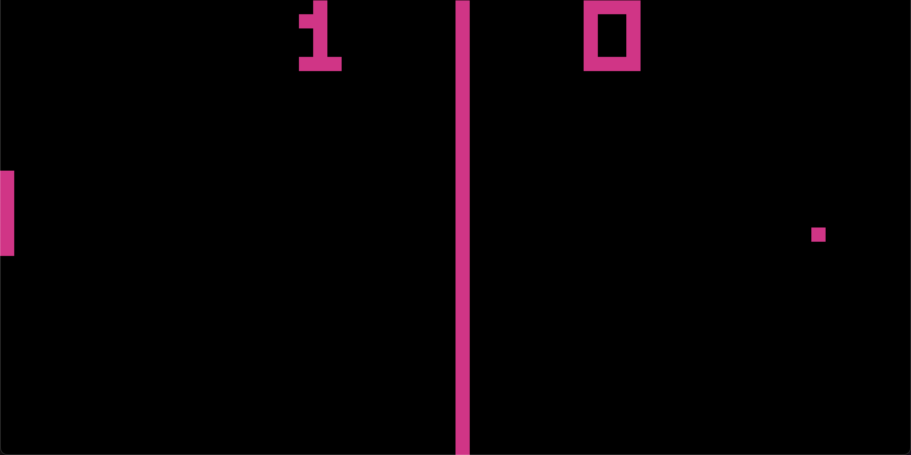
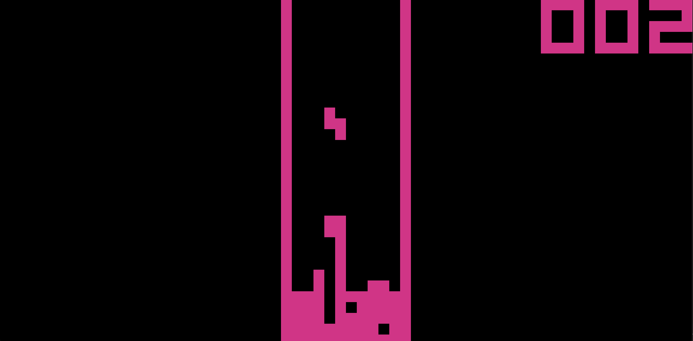

# A chip 8 interpreter built with Rust

Never heard of chip 8? Neither did I. It's an interpreted programming language developed in the 1970s used for making an playing games on computers of that era. Since then it's become a popular hobby platform for making and playing simple games. Learn more here [Chip 8 on wikipedia](https://en.wikipedia.org/wiki/CHIP-8)

This is my first project built with rust. I learned about chip 8 when looking for good first projects to learn a programming language. The rest is history.

## Screenshots from the project:




## How to run?

`cargo run`

or, after building

```
cargo build --release
./target/release/chip8 [path/to/rom]
```

## Controls

The emulator maps your keyboard to the 16-key CHIP-8 keypad using physical key positions (via scancodes in match_key).

Layout:

```
1 2 3 4   →  1 2 3 C
Q W E R   →  4 5 6 D
A S D F   →  7 8 9 E
Z X C V   →  A 0 B F
```
